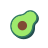

<p align="center">
  
  <h1 align="center">Avocado</h1>
</p>

<p align="center">
  
  <a href="https://packagist.org/packages/ramon/avocado"></a>
  <a href="https://packagist.org/packages/ramon/avocado"></a>
  <a href="https://donate.stripe.com/fZe5o66nebkf39S28a"></a>
</p>

<p align="center">
  A custom <a href="https://flarum.org">Flarum</a> theme with hero banners, tag colors, share buttons, and more. Forked from <a href="https://github.com/afrux/asirem">Asirem</a> by <a href="https://github.com/afrux">Afrux</a>.
</p>

---

## Features

- **Hero Banner** — Upload and position a custom banner image at the top of your forum (auto-scaled to 1400px, converted to WebP)
- **Tag Colors** — Discussion list items styled with tag colors and unread indicators
- **Share Button** — Native Web Share API on mobile; clipboard fallback on desktop
- **Action Icons** — Optional Font Awesome icons on Like and Reply buttons
- **Tags Page** — Custom tile and cloud view for the tags page
- **V1 Search Bar** — Toggle between the classic dropdown search and the default modal

## Requirements

- Flarum `^2.0.0`

## Installation

```sh
composer require ramon/avocado
```

## Updating

```sh
composer update ramon/avocado --with-dependencies
php flarum cache:clear
```

## Configuration

All settings are available in the admin panel under the Avocado extension:

| Setting | Description | Default |
|---|---|---|
| Hero Image | Upload a banner image for the forum header | — |
| Hero Image Position | CSS `background-position` value | `center top` |
| V1 Search Bar | Use classic dropdown search instead of modal | `true` |
| Show Share Button | Display share button on posts | `true` |
| Show Action Icons | Show icons on Like and Reply buttons | `true` |
| Fixed Avatar Effect | Keep comment avatars sticky while reading posts on desktop | `true` |

## API Endpoints

| Method | Endpoint | Description |
|---|---|---|
| `POST` | `/api/avocado/banner` | Upload hero banner image |
| `DELETE` | `/api/avocado/banner` | Remove hero banner image |

## Links

- [GitHub](https://github.com/ram0ng1/avocado)
- [Issues](https://github.com/ram0ng1/avocado/issues)
- [Discuss](https://discuss.flarum.org/d/35041-colored-an-extension-to-color-elements-based-on-tag-colors/37)
- [Donate](https://donate.stripe.com/fZe5o66nebkf39S28a)

## Authors

- [Ramon Guilherme](https://ramonguilherme.com.br)
- [Sami Mazouz](https://www.buymeacoffee.com/sycho) — original Asirem theme

## License

[MIT](LICENSE.md)
